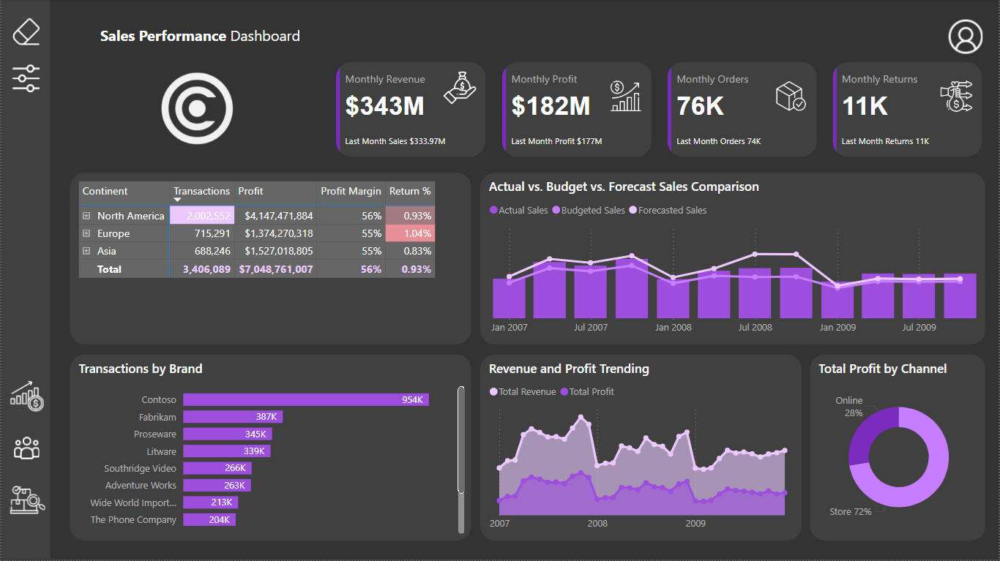
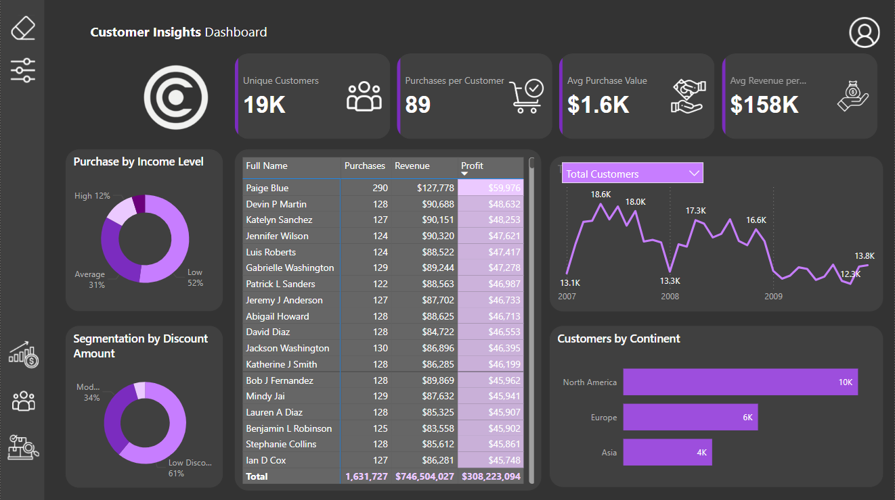
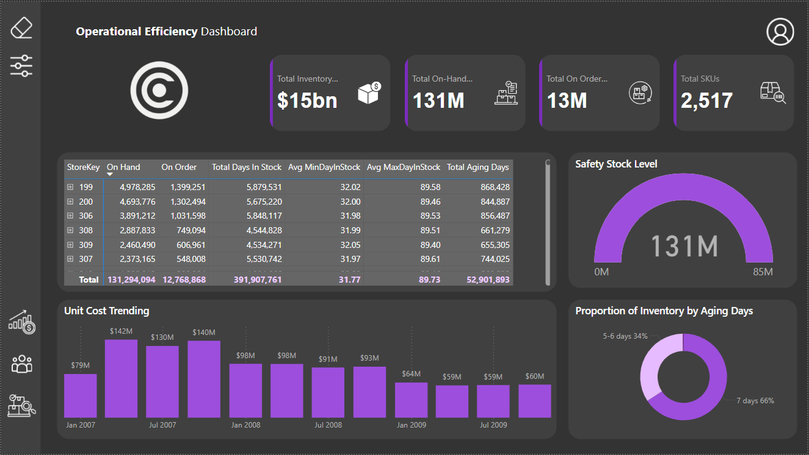

# Contoso Sales Dashboard

This repository showcases a Contoso Dashboard created by me for study purposes. The dashboard is designed to demonstrate my skills in dashboard design, DAX, and data insights. The dataset used is from the Contoso database, and the dashboard is divided into three main pages: Sales Performance, Customer Insights, and Operational Efficiency.

## End-Users
The primary end-users of this dashboard are:
- **Sales Managers**: To monitor sales performance and identify opportunities for improvement.
- **Marketing Teams**: To understand customer behavior and tailor marketing strategies.
- **Inventory Managers**: To optimize inventory levels and ensure operational efficiency.
- **Executives and Stakeholders**: To get a high-level overview of the company's performance and make informed strategic decisions.

## Key Business Goals and Objectives
The key business goals and objectives addressed by this dashboard include:
- **Maximizing Sales and Profitability**: By providing detailed insights into sales performance and trends.
- **Enhancing Customer Understanding**: By analyzing customer demographics and behavior to drive targeted marketing efforts.
- **Optimizing Inventory Management**: By tracking inventory levels, aging, and safety stock to reduce costs and meet demand efficiently.
- **Improving Decision-Making**: By presenting key metrics and trends in a clear, easily digestible format.

## Most Important Questions Answered
The dashboard is designed to answer several critical business questions:
1. **Sales Performance**:
   - What are the current monthly revenue, profit, orders, and returns?
   - How do actual sales compare to budgeted and forecasted sales over time?
   - Which regions and brands are contributing most to sales and profit?

2. **Customer Insights**:
   - How many unique customers are there, and what is their purchase behavior?
   - What is the revenue and profit generated by each customer?
   - How are customers segmented by income level and discount utilization?

3. **Operational Efficiency**:
   - What is the total value and quantity of inventory on hand and on order?
   - How is inventory aging, and what are the safety stock levels?
   - What are the unit cost trends over time?

## Dashboard Pages

### Sales Performance Dashboard

#### Analysis:
The Sales Performance Dashboard provides a high-level overview of the company's financial metrics and sales activities. Key indicators such as monthly revenue, profit, orders, and returns are prominently displayed, allowing for quick assessment of current performance. The dashboard also offers detailed insights into geographic sales distribution, brand performance, and sales trends over time. This page is essential for understanding how different regions and products contribute to overall sales and profitability, as well as for tracking performance against budgeted and forecasted targets.

### Customer Insights Dashboard

#### Analysis:
The Customer Insights Dashboard delves into customer demographics and behavior, providing valuable information on customer engagement and value. It highlights key metrics such as unique customers, purchase frequency, and average purchase value. The dashboard also segments customers based on income levels and discount utilization, offering a deeper understanding of customer profiles. Detailed data on individual customer purchases, revenue, and profit helps identify high-value customers and tailor marketing strategies. Additionally, the dashboard tracks customer trends over time and provides a geographical breakdown of the customer base, supporting targeted marketing and sales efforts.

### Operational Efficiency Dashboard

#### Analysis:
The Operational Efficiency Dashboard focuses on inventory management and operational metrics. It provides a comprehensive view of total inventory value, on-hand and on-order quantities, and the number of SKUs. The dashboard includes detailed metrics on inventory levels and aging by store, helping to optimize stock management and reduce excess inventory. Safety stock levels and unit cost trends are also tracked to ensure cost efficiency and readiness to meet demand. This page is crucial for maintaining operational efficiency, managing costs, and ensuring that inventory levels are aligned with sales demand.

## Navigation and Additional Features

The dashboard includes a navigation panel with icons to switch between pages and options to clear filters or apply various filters, including date filters. An icon in the top right corner provides access to my personal information such as LinkedIn, GitHub, CV, and email, feel free to reach out and provide feedback :)

## Conclusion

This Contoso Sales Dashboard is created for study purposes to showcase my abilities in dashboard design, DAX, and extracting valuable data insights. The goal was to present information as clearly as possible, providing a comprehensive view of sales performance, customer insights, and operational efficiency to enable informed decision-making and strategic planning.

Feel free to explore the dashboard and reach out if you have any questions or feedback 🫶
